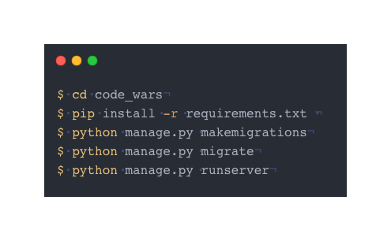

# Code-Colab-Hub  
## Code-Wars 

Welcome to ***Code-Wars*** which is an open-source project that is open for *Commits, Fork* or can give suggestions

Code-Wars is a web application where clients can Solve Quality problems based on their *interests* . Here they can collaborate make *Friends, Groups and solve problems*.
 ## 🛠 Tecnologys used
 * Javascript, CSS, HTML  
 * Python 3.12.1  
 * Django 5.0.2  
 * Bootstrap 5.0
 * SQLITE 

## Run Locally

Clone the project

```bash
  git clone https://github.com/Rajasimhareddybolla/Final_project_cs50w.git
```

Go to the project directory

```bash
  cd code_wars
```

Install dependencies

```bash
  pip install -r requirements. txt 
```
Activate Database  
```bash
    Python manage.py makemigrations
    python manage.py migrate
```

Start the server

```bash
  python manage.py runserver
```



## Features <a id="2"></a>
- Solve problems daily
- Collaborate with friends
- Make groups 
- Share Your Ideas
- Cross-platform
- Responsive design
- User Friendly
## Scope for Contribution
> Can Contribute by reducing code redundancy.  
> Asynchronous Chat and Connections  
> Live challenge with real-time Users.  
>  Can modify the front-end  
> Adding Live Validation of Answers  
> Code optimisation


## <a id="chapter-1"></a> Documentation

[Documentation](code_wars/reference_section/documentation.md)  
Refer to this section for Documentation of this project for code reference

#### Things I learnt during this project

There are many problems that I tackled on completion of this project from Primary Design to Deployment which I documented [hear](code_wars/reference_section/things_i_learnt.txt)

#### Basic_design of this project
[Figma Design](https://www.figma.com/file/oUbIeTRjEkV49fJMhmxMEY/Untitled?type=design&node-id=0%3A1&mode=dev&t=B5z1c2mCc40TANYx-1)
## Contributors

Contributions are always welcome!


Please adhere to this project's `code of conduct`.

## Distinctiveness and Complexity
Hear this section exclusively for CS50 check authorities as mentioned this project is not on the following projects 
> 1) commerce (Not at all related to that)  is totally a web application that is related to buying and selling things such as Amazon, and Flipkart such things but when we look up this project it is completely built differently. my project is based on collaborating and tackling problems.
> 2) Social networking (I implemented a feature to connect or msg with each other it's just a feature )(that does not resemble the whole project) while my project brings the idea for collaboration by the sense of messages my project is not restricted only restricted to messaging but it has more than that as I mentioned in the features section.
>    My project is built on a solid foundation stating that the unimplemented concepts in most of the problem-solving apps like leetcode , CodeChef, and coding ninjas such that my project went an implement the rest of the features including the  collaboration part which makes this project unique at the same time to tackle with multiple elements such as Users, Groups, Questions and the solved problems, friends which make this project much more complicated. when we see the database section in the documentation which is attached we can come to know how complicated things going on and around the project with foreign keys.
>    Not only that model's creation but when we come to the usage of javascript it takes a lot of time to build that due to many pages with different functionalities being directly connected to the single page javascript which makes it much more complicated to work with them and 

As I mentioned above the features of this [project](#2) can state the uniqueness of this project and how it is more complex than other 


please refer to this doc for more information about the project/files  / how it works

Refer to [Documentation](code_wars/reference_section/documentation.md)  
