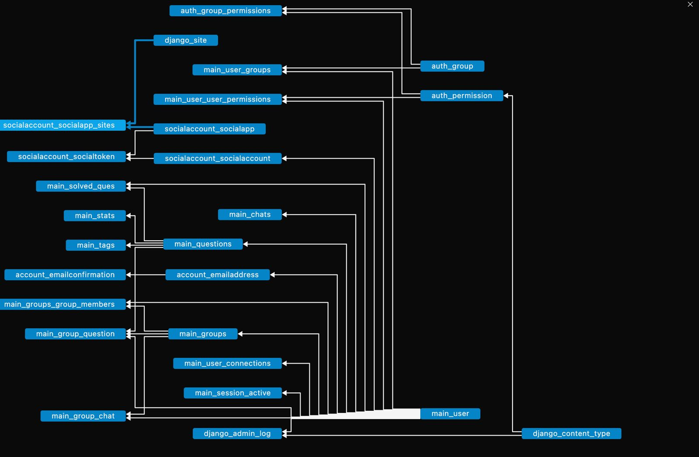

# Welcome to Code-Wars!

It all started with an idea where I and my friend decided to solve a DSA problem daily on LeetCode.
Here where I faced the issue that we couldn't chat with each other to share ideas right at the question which made us overwhelmed. so I decided to create this application where you can solve a problem and collaborate with your friend right at the specific question.

## About the files 
### [code_wars](#code_wars-1)
### [reference_section](#reference_section-1)
### [sqlite3.db](#creating-databases)
### [uploads](#uploads-1)

# First-Move

We all know that it's the toughest part of any project which is true in my case. So I made my move by *creating a basic* **design** for my pages on [Figma](https://www.figma.com/file/oUbIeTRjEkV49fJMhmxMEY/Untitled?type=design&node-id=0-1&mode=design&t=AHA7MezMoTnzuOC7-0) You can check it out.

##  Creating-Databases
This is a crucial part of any web application which is interconnected with most of the functionality of the applications. 
I have the list of features for my web design which saves a lot of time in designing the databases

##  Creating Html - Pages
This is a way bit easier but is a time-death process that consumes most of the time (I have decided to use BootStrap rather than copy-past others' code)
As I said it is a TDS process and I used to create pages with some random data that might come from the server in feature.
## Search bar 
It is the one of the toughest part which i faced throught this project due to this functionality 
hear are the search commands to use  
> User : @  
> ex: @raja to search raja  
Group : $    
> ex: $pspk to search pspk  
Questiion: #  
> ex: # Rotate array  
which result's some suggestions with some unique code plz obey it otherwise it render some improper information
## Connecting with Backend
This step is just like the heart of the whole project which connects with more than 12 tables which makes the job difficult on getting data and rendering to page.
As we have the front end. template and data from tables such that it's not a big job to connect in a structured or planned way.

## JS file
which plays a crucial role in web design to render data asynchronously which reduces the reloads drastically. As a regular Python user, it is not easy to handle Java
script easily when compared to Python.
After adding Java script to my page which results in changing the layout of my page. At the same time, I added many features which are not in my pseudo design.
## [Things I learnt during this Journey](things_i_learnt.txt)

 - A lot when  i should talk about technical aspects mostly from 
		 - Java Script
		 - Django models
		 - Some CSS techniques
which are documented in my root folder such that you can go through it It is not actually well documented but it is a valuable resource to me.

## Features need to be implemented

 - More user-friendly Front - end design 
 - Live testing of the Answers immediately after submiting the answer
 - Fixing small Bugs
 - Adding asynchronous modifications when they follow or unfollow
	***  Making it into a single-page application**

## code_wars
This is the root-application of this web application which handels all the job needs for the implementation of this project throught backend service. 
The content it consists all are pre built with django and comes to hand by executing the **startproject** Djanog comand  
## main
This is my Django-application which i created to complete my web application which handels with   
1) ***urls.py*** which handels with the api requests from the user and render http responses from views.py
2) ***views.py*** which handels with the rendering part and data manuplation of database which include getting/manuplating data from the database
3) ***models.py*** consists the most usefull data in the form of django models such that creates schema for sqlite data base which can create tabels refer to this [sectiion](#creating-databases) which covers all the part of this section
4) ***templates*** which have all the front end meterial in the format of html syntax refer [hear](#creating-html---pages)
5) ***static*** conists all the static meterials such as styling/java script and some png which usefull for showing in achivments section

## uploads
this folder contain all the solved questions answers in the same format what they sent   
for an instance let raja uploaded a question on merge_array ques then the file is stored under uploads/raja/merge_array.format

which gaves the scope for evaluating the answers and giving grades easier from server

## reference_section
this section consists all the necessary data for devolper to understand like documentation updates.txt learnt_from_this project

** DONT TOUCH THE CODE IF IT WORKS **